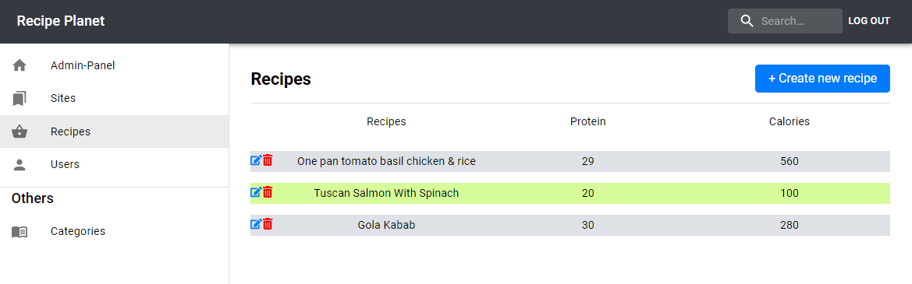

# Recipe Planet Admin Panel

An admini panel, where it is possible to add, delete and update recipes for the recipe planet app.

which you will find here:
[View recipe planet github](https://github.com/MadsHaerup/recipeplanet)

The admin consumes data from a strapi api which is deployed on heroku.

### Stack
* React
* Sass
* Material-UI (valgfri)
* react-hook-form (https://react-hook-form.com/get-started)
* Axios (https://www.npmjs.com/package/axios)

